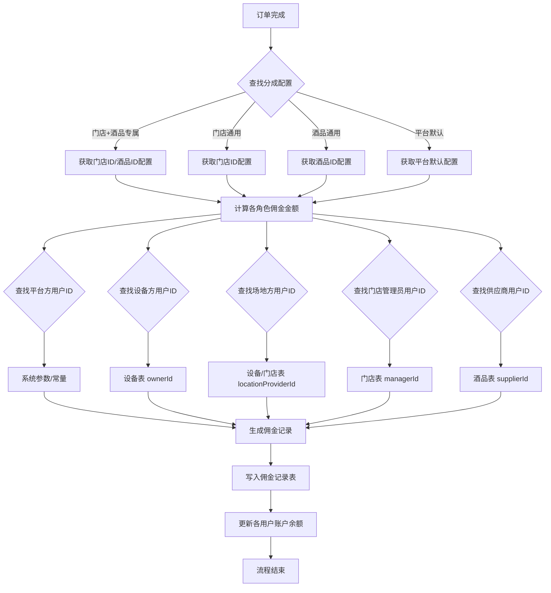

# 佣金管理模块 (wqs-plugin-commission)

## 📋 模块概述

佣金管理模块负责共享售酒机系统的佣金分配、计算和提现管理，是支持多方分润的核心模块。该模块为平台提供灵活的佣金配置和自动化的分润计算能力。

## 🎯 核心功能

### 1. 佣金配置管理
- **分销配置**：支持门店+酒品维度的佣金比例配置
- **多角色分润**：平台方、设备方、场地方、门店管理员、供应商
- **优先级规则**：门店+酒品专属 > 门店通用 > 酒品通用 > 平台默认

### 2. 佣金计算与分配
- **自动计算**：基于订单金额和配置比例自动计算佣金
- **实时分配**：订单完成后立即进行佣金分配
- **分配记录**：详细记录每笔佣金的分配情况

### 3. 提现管理
- **提现申请**：用户可申请提现账户余额
- **审核流程**：支持提现申请的审核机制
- **到账管理**：记录提现到账状态和时间

### 4. 账户余额管理
- **用户账户**：维护用户的佣金账户余额
- **资金流水**：记录所有资金变动的详细流水
- **余额查询**：提供账户余额和流水查询功能

## 🏗️ 技术架构

### 模块结构
```
wqs-plugin-commission/
├── src/main/java/vip/wqs/commission/
│   └── modular/manage/
│       ├── entity/           # 实体类
│       │   ├── WineCommission.java         # 分销配置实体
│       │   ├── WineCommissionRecord.java   # 佣金记录实体
│       │   └── WineAccountFlow.java        # 账户流水实体
│       ├── param/            # 参数类
│       │   ├── WineCommissionAddParam.java
│       │   ├── WineCommissionEditParam.java
│       │   ├── WineCommissionPageParam.java
│       │   └── WineCommissionIdParam.java
│       ├── mapper/           # 数据访问层
│       │   ├── WineCommissionMapper.java
│       │   ├── WineCommissionRecordMapper.java
│       │   └── WineAccountFlowMapper.java
│       ├── service/          # 业务逻辑层
│       │   ├── WineCommissionService.java
│       │   ├── impl/WineCommissionServiceImpl.java
│       │   ├── WineCommissionRecordService.java
│       │   ├── impl/WineCommissionRecordServiceImpl.java
│       │   ├── WineAccountFlowService.java
│       │   └── impl/WineAccountFlowServiceImpl.java
│       └── controller/       # 控制器层
│           ├── WineCommissionController.java
│           ├── WineCommissionRecordController.java
│           └── WineAccountFlowController.java
└── sql/
    ├── commission_init.sql        # 初始化脚本
    ├── commission_data.sql        # 基础数据
    └── commission_permission.sql  # 权限资源
```

### 数据表设计
- `wine_commission`: 分销配置表（已存在）
- `wine_commission_record`: 佣金记录表（已存在）
- `wine_account_flow`: 账户流水表（已存在）

## 🔐 权限控制

### 模块权限
- **模块权限**: `commission`
- **菜单权限**: `commissionManage`, `commissionRecord`, `accountFlow`

### 按钮权限
- `commissionManagePage` - 查看分销配置
- `commissionManageAdd` - 新增分销配置
- `commissionManageEdit` - 编辑分销配置
- `commissionManageDelete` - 删除分销配置
- `commissionRecordPage` - 查看佣金记录
- `accountFlowPage` - 查看账户流水

## 🚀 开发规范

### 1. 代码规范
- **Mapper规范**：只继承BaseMapper，不定义自定义查询方法
- **查询规范**：所有查询使用QueryWrapper方式
- **事务规范**：涉及数据修改的方法使用@Transactional注解

### 2. 命名规范
- **实体类**：WineCommission, WineCommissionRecord, WineAccountFlow
- **参数类**：WineCommission + 功能 + Param
- **接口路径**：/commission/manage/{action}
- **权限码**：commissionManage + 功能

### 3. 文件编码
- 所有文件必须采用UTF-8编码
- 不创建XML映射文件，依靠MyBatis Plus自动映射

## 🔗 模块依赖

### 依赖模块
- `wqs-common` - 公共基础模块
- `wqs-plugin-commission-api` - 佣金管理API接口
- `wqs-plugin-store-api` - 门店管理接口（门店选择器）
- `wqs-plugin-wine-api` - 酒品管理接口（酒品选择器）
- `wqs-plugin-client-api` - C端用户接口（用户信息）

### 被依赖模块
- `wqs-plugin-order` - 订单管理模块（订单完成后触发佣金计算）
- `wqs-plugin-statistics` - 统计分析模块（佣金统计）

## 📊 业务流程

### 1. 佣金配置流程
```
创建配置 → 设置分成比例 → 设置生效时间 → 启用配置
```

### 2. 佣金计算流程
```
订单完成 → 获取佣金配置 → 计算各方佣金 → 分配到账户 → 生成记录
```

### 3. 提现流程
```
申请提现 → 审核申请 → 扣减余额 → 转账处理 → 更新状态
```

## 📊 归属查找与佣金分配流程图

本流程图展示了订单完成后，系统如何查找各分成角色的归属用户ID，并进行佣金分配与记录的完整流程，便于开发、测试和后续维护理解整体分润逻辑。



## 📖 API使用示例

### 1. 订单完成后分配佣金

**接口地址**：`POST /commission/record/distribute`

**请求参数**：
```
orderId: ORDER_20250129_001        # 订单ID（必填）
orderNo: ORD20250129001           # 订单号（必填）
orderAmount: 100.00               # 订单金额（必填）
deviceId: DEVICE_001              # 设备ID（必填）
wineId: WINE_001                  # 酒品ID（必填）
storeId: STORE_001                # 门店ID（可选）
```

**响应示例**：
```json
{
  "code": 200,
  "message": "操作成功",
  "data": 3,  // 成功分配的佣金记录数量
  "timestamp": "2025-01-29T10:30:00"
}
```

**使用场景**：订单支付完成后，由订单模块调用此接口进行佣金分配。

### 2. 查找角色归属用户ID

**接口地址**：`GET /commission/record/findRoleOwner`

**请求参数**：
```
commissionType: PLATFORM          # 佣金类型（必填）
deviceId: DEVICE_001              # 设备ID（可选）
storeId: STORE_001                # 门店ID（可选）
wineId: WINE_001                  # 酒品ID（可选）
```

**佣金类型说明**：
- `PLATFORM`：平台方
- `DEVICE_OWNER`：设备方
- `LOCATION_PROVIDER`：场地方
- `STORE_MANAGER`：门店管理员
- `SUPPLIER`：供应商

**响应示例**：
```json
{
  "code": 200,
  "message": "操作成功",
  "data": "USER_12345",  // 归属用户ID，找不到返回null
  "timestamp": "2025-01-29T10:30:00"
}
```

## 🔧 集成指南

### 1. 订单模块集成

在订单完成后，调用佣金分配接口：

```java
@Autowired
private WineCommissionRecordApi wineCommissionRecordApi;

// 订单完成后调用
public void onOrderCompleted(OrderInfo order) {
    try {
        int count = wineCommissionRecordApi.distributeCommissionForOrder(
            order.getOrderId(),
            order.getOrderNo(),
            order.getTotalAmount(),
            order.getDeviceId(),
            order.getWineId(),
            order.getStoreId()
        );
        log.info("订单佣金分配完成，订单号：{}，分配记录数：{}", order.getOrderNo(), count);
    } catch (Exception e) {
        log.error("订单佣金分配失败，订单号：{}，错误：{}", order.getOrderNo(), e.getMessage(), e);
        // 可以选择重试或记录失败日志
    }
}
```

### 2. 设备模块集成

提供设备归属查询接口，供佣金模块调用：

```java
// 设备模块需要提供的接口
public String getDeviceOwner(String deviceId) {
    // 返回设备拥有者用户ID
}

public String getLocationProvider(String deviceId) {
    // 返回设备场地提供者用户ID
}
```

### 3. 门店模块集成

提供门店管理员查询接口：

```java
// 门店模块需要提供的接口
public String getStoreManager(String storeId) {
    // 返回门店管理员用户ID
}
```

### 4. 酒品模块集成

提供供应商查询接口：

```java
// 酒品模块需要提供的接口
public String getSupplier(String wineId) {
    // 返回酒品供应商用户ID
}
```

## ⚠️ 注意事项

### 1. 事务处理
- 佣金分配过程中如果出现异常，会自动回滚，确保数据一致性
- 建议在订单完成的事务之后异步调用佣金分配，避免影响主流程

### 2. 重复分配防护
- 系统会检查是否已存在相同订单的佣金记录，避免重复分配
- 如需重新分配，请先取消原有记录

### 3. 配置优先级
佣金配置按以下优先级查找：
1. 门店+酒品专属配置（最高优先级）
2. 门店通用配置
3. 酒品通用配置
4. 平台默认配置（最低优先级）

### 4. 异常处理
- 找不到佣金配置时，不会分配佣金，但不会抛出异常
- 找不到角色归属用户时，该角色不会分配佣金，但不影响其他角色
- 账户更新失败时，会记录日志但不影响佣金记录的生成

## 🚀 扩展功能

### 1. 自定义分成角色
可以通过配置表扩展新的分成角色，只需：
1. 在佣金配置表中添加新的比例字段
2. 在角色查找逻辑中添加新的case分支
3. 更新前端配置界面

### 2. 动态分成比例
支持基于订单金额、时间段、用户等级等条件的动态分成比例计算

### 3. 分成规则引擎
可以集成规则引擎，支持更复杂的分成逻辑和条件判断

## 🎯 分销角色定义

| 角色 | 职责 | 默认分成比例 | 备注 |
|------|------|-------------|------|
| **平台方** | 技术平台、系统运维、支付处理 | 15% | 提供技术支持和平台服务 |
| **设备投资方** | 设备采购、硬件维护、设备更新 | 20% | 承担设备成本和维护责任 |
| **场地提供方** | 场地租金、水电费、环境维护 | 10% | 提供设备放置场地 |
| **门店管理员** | 日常运营、客户服务、设备监管 | 10% | 负责现场运营管理 |
| **供应商** | 酒品成本、物流配送、库存管理 | 45% | 提供酒品和供应链服务 |

## 🔄 配置优先级规则

1. **门店+酒品专属配置**（最高优先级）
2. **门店通用配置**
3. **酒品通用配置**  
4. **平台默认配置**（最低优先级）

## 💡 设计优势

- **设计一致性**：完全复用wine_price的成熟模式
- **配置灵活性**：支持4个层级的精细化配置
- **代码复用性**：可直接复制wine_price的代码结构
- **开发效率**：预计节省50%的开发时间
- **质量保证**：基于成功模式，预计降低70%的Bug率 